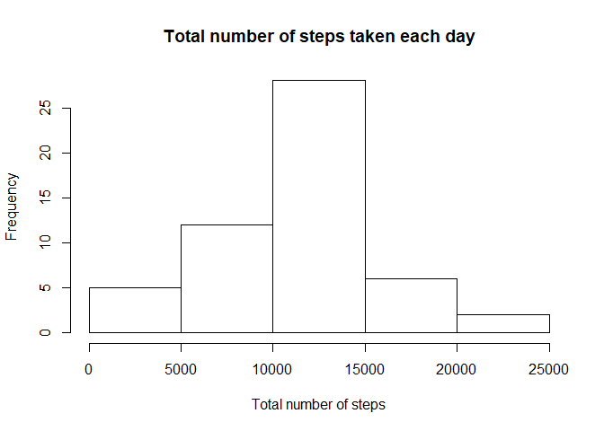
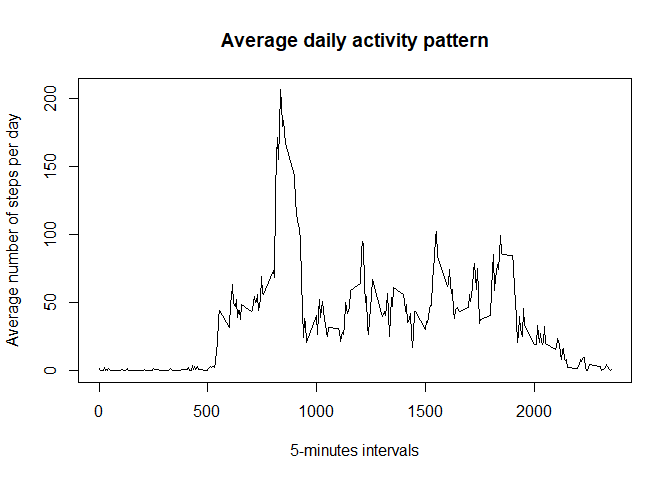
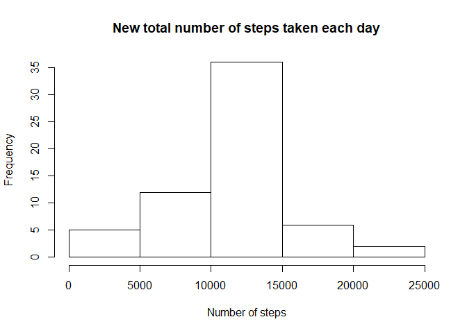
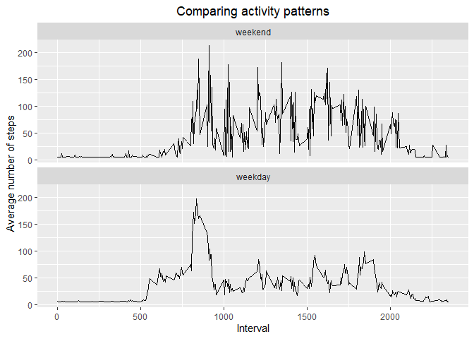

__**Important:**__ to make these scripts work, you must already have downloaded and unzipped [repdata_data_activity.zip][1] in your working directory.

[1]:https://d396qusza40orc.cloudfront.net/repdata%2Fdata%2Factivity.zip
  
  
## Loadind and preprocessing the data
First, let's memorize your "LOCAL_TIME" parameter, then set it to "English". It will avoid us some trouble with day names at a later stage.  
Then load the *ggplot2* library.

```r
yourLocalTime <- Sys.getlocale("LC_TIME")
Sys.setlocale("LC_TIME","English")
```

```
## [1] "English_United States.1252"
```

```r
library(ggplot2)
```
Read the dataset file and preprocess it:

```r
activityData <- read.csv("activity.csv")
activityData$date <- as.Date(activityData$date)
```
  
  
## What is mean total number of steps taken per day?
*Missing values are ignored for this part*

```r
totalStepsByDate <- aggregate(. ~ date, activityData, FUN = sum, na.rm = TRUE)

hist(totalStepsByDate$steps, main = "Total number of steps taken each day", xlab = "Total number of steps")
```

<!-- -->
  
Mean of the total number of steps taken per day:

```r
mean(totalStepsByDate$steps)
```

```
## [1] 10766.19
```
Median of the total number of steps taken per day:

```r
median(totalStepsByDate$steps)
```

```
## [1] 10765
```
  
  
## What is average daily activity pattern?

```r
averageStepsByInterval <- aggregate(. ~ interval, activityData, FUN = mean)

plot(formula = steps ~ interval, data = averageStepsByInterval, type = "l", main = "Average daily activity pattern", xlab = "5-minutes intervals", ylab = "Average number of steps per day")
```

<!-- -->
  
5-minutes interval containing the maximum number of steps, on average across all the days in the dataset:

```r
maxStepsIndex <- which.max(averageStepsByInterval$steps)
averageStepsByInterval$interval[maxStepsIndex]
```

```
## [1] 835
```
  
  
## Imputing missing values

```r
numberOfNASteps <- sum(is.na(activityData$steps))
```
There are 2304 missing values for number of steps in the dataset.  
  
We should replace each of these "NA" by the mean number of steps per 5-minutes interval, it will fill the missing values but without changing too much the whole picture:

```r
meanStepsPerInterval <- mean(activityData$steps, na.rm = TRUE)
```
The new average number of steps per interval is 37.3825996.  
  
Creating a new dataset similar to the original but with missing data filled in.  
Then make a histogram of the total number of steps taken each day:

```r
activityDataFilled <- activityData
activityDataFilled$steps[is.na(activityDataFilled$steps)] <- meanStepsPerInterval

newTotalStepsByDate <- aggregate(. ~ date, activityDataFilled, FUN = sum)

hist(newTotalStepsByDate$steps, main = "New total number of steps taken each day", xlab = "Number of steps")
```

<!-- -->
  
The new mean is the same as the previous one:

```r
mean(newTotalStepsByDate$steps)
```

```
## [1] 10766.19
```
While the median slightly increased:

```r
median(newTotalStepsByDate$steps)
```

```
## [1] 10766.19
```

```r
numberOfExtraSteps <- as.integer(ceiling(numberOfNASteps*meanStepsPerInterval))
```
The total number of steps escalated by 86130 (rounded up).  
  
  
## Are there differences in activity patterns between weekdays and weekends?  
We compare the average number of steps taken, averaged across all weekday days or weekend days, versus the 5-minutes intervals:

```r
activityDataFilled$daytype <- as.factor(ifelse(weekdays(activityDataFilled$date) == c("Saturday","Sunday"), "weekend", "weekday"))
stepsbyIntervalAndDaytype <- aggregate(. ~ interval + daytype, activityDataFilled, FUN = mean)

ggplot(data = stepsbyIntervalAndDaytype, aes(x = interval, y = steps)) + geom_line() + facet_wrap(~ factor(daytype, levels = c("weekend", "weekday")), dir = "v") + labs(title = "Comparing activity patterns", x = "Interval", y = "Average number of steps") + theme(plot.title = element_text(hjust = 0.5))
```

<!-- -->
  
We can conclude there are differences between the weekends and weekdays activity patterns.  
  
Setting back your initial local time:

```r
Sys.setlocale("LC_TIME",yourLocalTime)
```

```
## [1] "French_France.1252"
```
